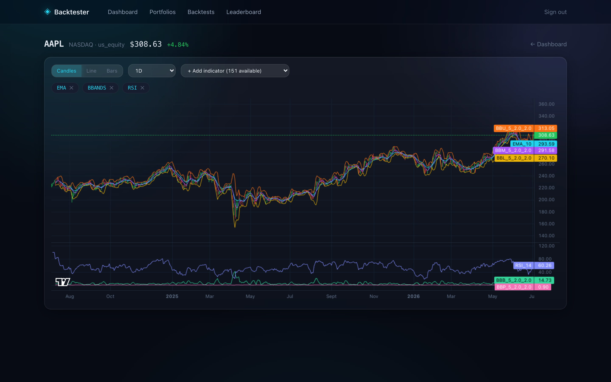
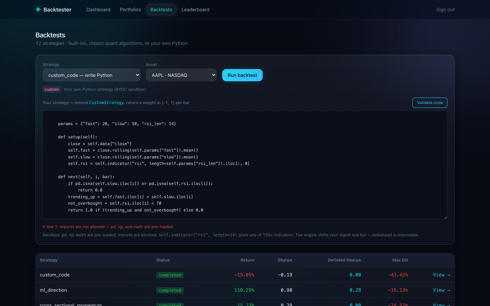
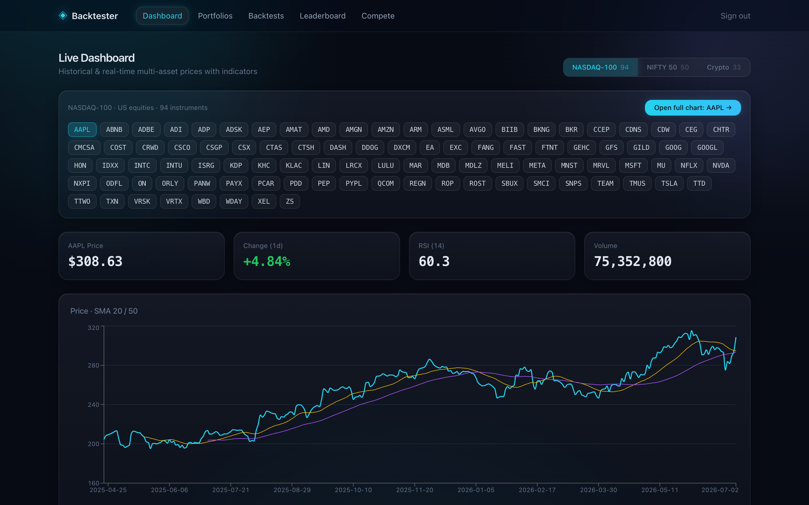
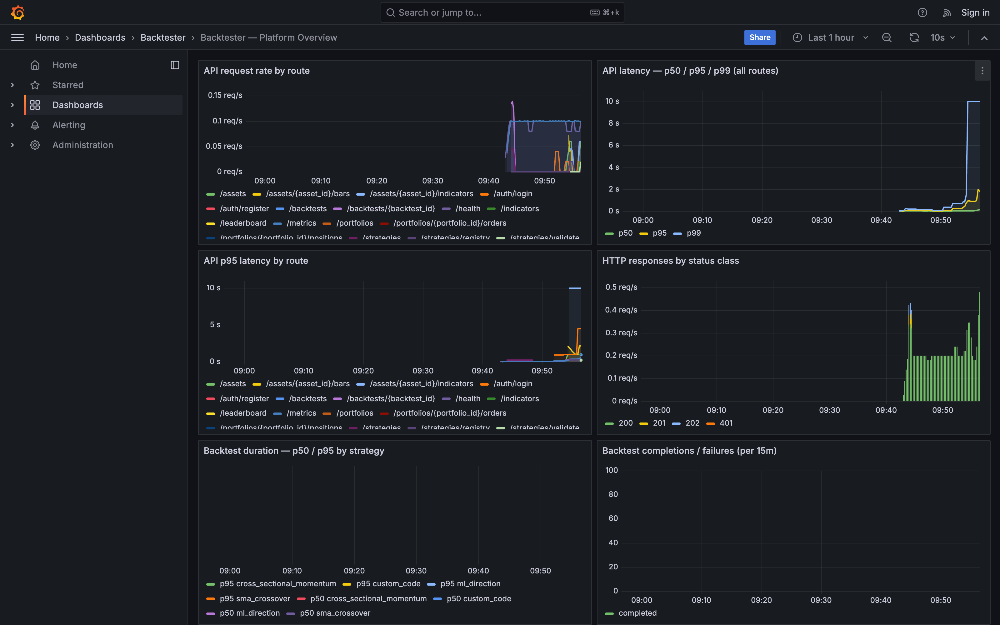
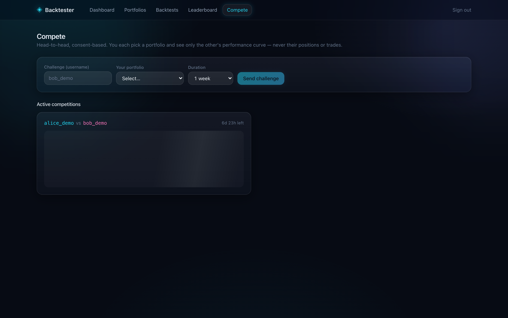
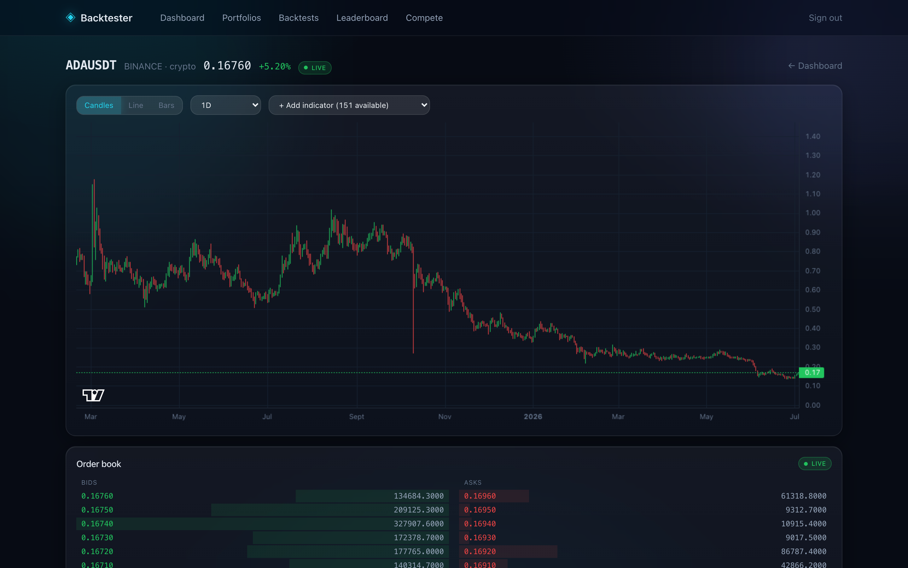
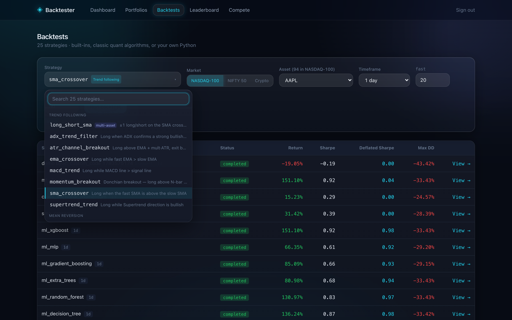
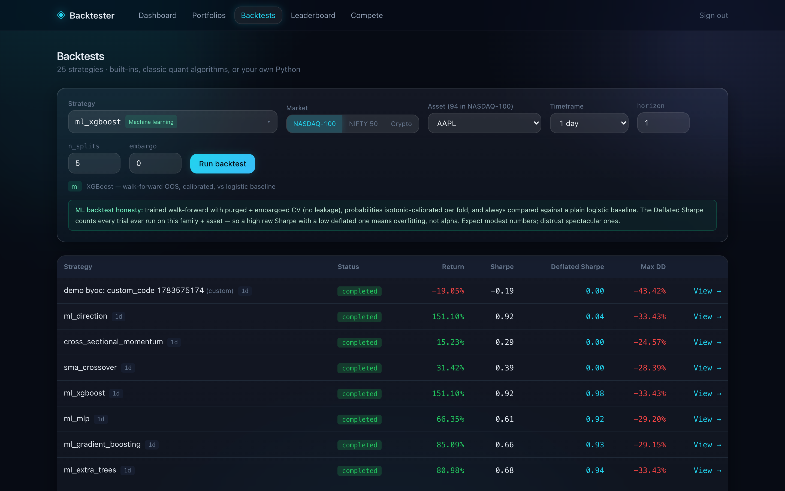
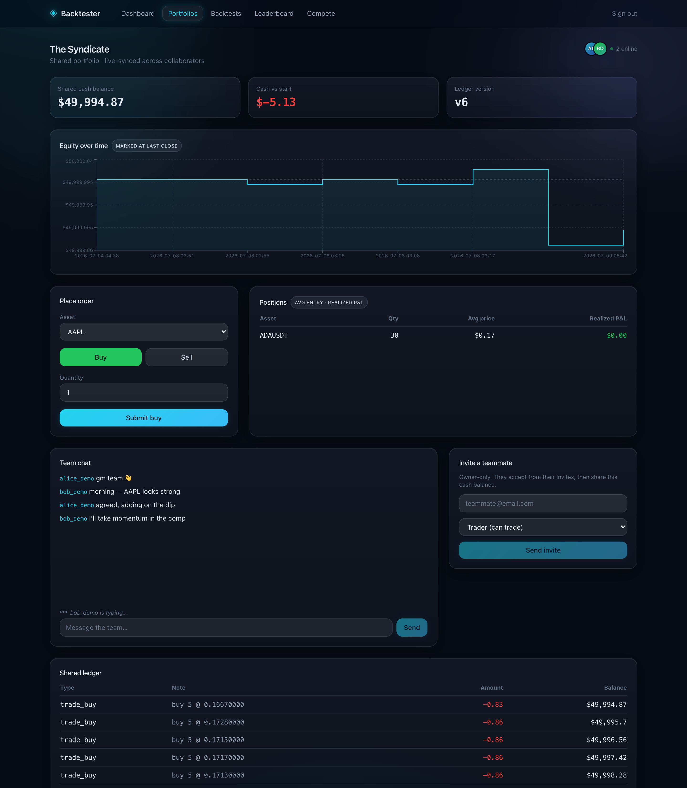

# Backtester — multi-asset backtesting & multiplayer paper trading

[](https://github.com/Manav0559/multi-asset-backtester/actions/workflows/ci.yml)


[](LICENSE)


**🔴 Live demo: [multi-asset-backtester.vercel.app](https://multi-asset-backtester.vercel.app)** —
log in as `alice@demo.backtester.dev` / `demo-pass-123`
(API: [backtester-x37r.onrender.com](https://backtester-x37r.onrender.com/docs); free-tier
backend sleeps when idle, so the first request can take ~30–60s to wake).

## Why I built this

I wanted to test volatility and momentum ideas properly, and kept running into
the same two walls: real backtesting infrastructure (point-in-time data, honest
statistics, execution costs) is priced for institutions, and every "learn to
trade" site hands you a backtester that quietly lies — lookahead in the
features, cherry-picked Sharpe ratios, fills at prices nobody gets. So I built
the thing I wanted to use: a platform where the statistics are honest by
construction (Deflated Sharpe, purged walk-forward CV, `shift(1)` everywhere),
where my friends and I can trade the same shared portfolio and argue about it
in the chat, and where the whole stack — FastAPI, Postgres, Next.js, WebSockets
— runs on **$0.00/month of cloud**. The free-tier constraint turned out to be
the most interesting engineering problem in the repo: no Celery, no Redis, no
managed extensions, one process doing the work of five.

Write strategies (or bring your own Python), backtest them on real historical
prices with honest statistics, paper-trade live-ish prices inside **shared**
portfolios with margin and shorting, and run consent-based head-to-head
competitions.

| | |
| --- | --- |
|  |  |
|  |  |

| | |
| --- | --- |
|  |  |
|  |  |
|  | |

> Screenshots are generated, not hand-taken: `./scripts/demo.sh` then
> `cd frontend && node scripts/capture-screenshots.mjs` re-captures all of them
> against the seeded stack (headless system Chrome via Playwright).

---

## One-command local demo

```bash
./scripts/demo.sh
```

Builds and starts the full stack, backfills **real** AAPL + MSFT (5y,
yfinance) and BTC (Binance) daily history, creates two demo users with public
portfolios and real trades, and runs one backtest of every kind — classic,
long/short portfolio, XGBoost ML, and user-submitted Python. When it prints
`✔ demo ready`:

| What | Where | Login |
| --- | --- | --- |
| App | http://localhost:3000 | `alice@demo.backtester.dev` / `demo-pass-123` |
| Grafana | http://localhost:3001/d/backtester-main | `admin` / `admin` |
| Prometheus | http://localhost:9090/alerts | — |

(Ports overridable: `FRONTEND_PORT=3005 ./scripts/demo.sh`.)

---

## Feature tour

**1 · TradingView-grade indicator engine.** One `IndicatorService`
(pandas-ta, **151 indicators**) serves the charting API, the built-in
strategies, and the user sandbox — so a chart overlay and a backtest of the
same indicator can never disagree. Params are validated against real
signatures; ichimoku's forward span is dropped because it is future-dated
output (lookahead).

**2 · Strategy registry on one contract.** Every algorithm — legacy
factories, class-based classics (Donchian breakout, Bollinger reversion, MACD
trend, z-score **pairs trading**), ML, user code — implements the same
`BaseStrategy` target-weight contract: weights per asset per bar, `>0` long,
`<0` short, `sum(|w|)` = gross leverage. `GET /strategies/registry` drives the
frontend, which hardcodes nothing.

**3 · Bring-your-own-code sandbox.** Users submit a Python class
(`setup()` / `next(i, bar)` / vectorized `generate()`, plus
`self.indicator("rsi", length=14)`); an AST allowlist rejects imports, dunder
access, and exec/eval **with line numbers, at submission time**; execution runs
under curated builtins with a memory rlimit and a hard wall-clock kill, and
output is clipped to the weight contract. The engine's `shift(1)` applies to
user code too — lookahead is structurally impossible.

**4 · Honest ML, not demo ML.** Seven model families (logistic → XGBoost)
behind one leakage-hardened pipeline: purged + embargoed walk-forward CV
(purge ≥ label horizon), isotonic calibration fit inside the training fold,
a logistic baseline on every fold, Brier scores, and triple-barrier
meta-labeling where the calibrated probability *is* the position size.
Hyperparameters are searched on the earliest fold only (leak-free), and every
run is logged to an `ml_experiments` table. Reports show Deflated Sharpe
against the **real** number of trials attempted — the platform counts them.

**5 · Margin, shorting, and frictions.** Shared portfolios support 2×
leverage and short selling with Reg-T-style 150% initial margin, enforced
under the same row lock that serializes the shared ledger. Fills pay
configurable slippage on both sides; backtests charge commission, slippage,
and optional square-root market impact on turnover.

**6 · Social trading.** Shared portfolios with role-based membership
(owner/trader/viewer) and an invite→accept flow; **team chat** per portfolio,
delivered live over the same WebSocket room, rate-limited, with author
soft-delete; live actor attribution ("alice bought AAPL") on every fill.

**7 · Consent-based competitions.** No global leaderboard — you challenge a
specific user, both opt in on portfolios you each choose, and each side sees
**only** the other's aggregate performance (return, drawdown, windowed Sharpe,
win rate, trade count, normalized equity curve) — never their positions,
trades, or strategy. Enforced server-side by a whitelisted schema (a snapshot
test fails loudly if a field is ever added). Results freeze at the end of the
window and stay immutable as portfolios keep trading.

**Plus the platform underneath:** multiplayer portfolios sharing ONE cash
balance (row-locked, idempotent fills, WebSocket-synced), a transactional
outbox so fill events survive crashes, periodic equity snapshots backing the
competition windows, a reaper that heals hard-killed backtests, and a
provisioned Prometheus + Grafana observability stack with alerting.

---

## Architecture

Everything runs in **one FastAPI process** — that's the deployment constraint
(free tier) turned into a design decision, not an accident:

```
              Next.js 14 (App Router, TS, lightweight-charts, framer-motion)
                   │  /api rewrite (same-origin)      │ WebSocket /ws
                   ▼                                  ▼
              FastAPI ─────────────────► in-process asyncio bus (WS fan-out)
               │    │
               │    ├── BackgroundTasks ── backtest runner (memory/time capped)
               │    ├── asyncio scheduler ─ equity snapshots · FX refresh ·
               │    │                       daily-bar append · outbox relay ·
               │    │                       reaper · challenge finisher
               │    └── on-demand pricing ─ held-asset marks, 25s TTL cache
               ▼
          PostgreSQL (Neon free tier — plain tables, no extensions required)
          ledger · positions · OHLCV · outbox · snapshots · ml_experiments

          deploy: Vercel (frontend) + Render (backend) + Neon (Postgres) = $0
          local:  docker compose --profile app up  (adds Prometheus + Grafana)
```

- **Backend** — Python 3.13, FastAPI, SQLAlchemy 2.0, Alembic. No Celery, no
  Redis: background work is `BackgroundTasks` + an asyncio scheduler, and the
  WebSocket hub fans out over an in-process bus.
- **Data** — vanilla PostgreSQL. Migrations detect a full TimescaleDB install
  and use hypertables/compression when the license allows; on managed Postgres
  (Neon ships the Apache build) they fall back to plain tables automatically.
- **Quant/ML** — pandas, numpy, scipy, pandas-ta, scikit-learn, xgboost.
- **Observability** — prometheus-client at `/metrics`, alert rules, and a
  fully provisioned Grafana dashboard (local compose profile).

---

## Quick start (dev loop)

```bash
docker compose up -d                        # db only, :5433

cd backend
python -m venv .venv && . .venv/bin/activate
pip install -r requirements-dev.txt
alembic upgrade head
uvicorn app.main:app --port 8000            # one process — that's the whole backend

cd ../frontend && npm install && npm run dev
```

Full stack instead: `docker compose --profile app up -d --build` (a one-shot
`migrate` service must exit 0 before the backend starts, so nothing races an
unmigrated DB).

Tests: `cd backend && python -m pytest tests/ -q` (needs the db up).
CI runs the suite against ephemeral Postgres containers and builds + lints the
frontend on every push.

---

## Observability & alerting

- Every request gets an `X-Request-ID` + structured access log; Prometheus
  metrics at `GET /metrics` labeled by **route template** (bounded
  cardinality), including `backtest_duration_seconds{strategy,status}`, WS
  fan-out health, and DB pool saturation.
- **Alert rules** (`observability/alerts.yml`): API 5xx ratio > 5%, p99 > 1s,
  backtest failure ratio > 20%, and equity-snapshot staleness (scheduler
  silent 15+ min). They surface on the Grafana dashboard's alert row.
- **Grafana is fully provisioned from the repo** — datasource + dashboard JSON
  under `observability/grafana/`; nothing is clicked together by hand.
- In-memory fixed-window rate limiter (120 req/min, fails open — see
  tradeoffs).

---

## Data provenance

Every price on screen is labeled with where it came from. Nothing is fabricated:
if a surface can't be fresh, it says so on the surface itself, and a global
banner appears the moment the live link drops (auto-reconnects).

| Surface | Source | Freshness | Badge |
| --- | --- | --- | --- |
| Crypto price / book | Binance REST, fetched on demand | seconds | `DELAYED` |
| Equity price during market hours | yfinance poll (scheduler, exchange-calendar-aware) | vendor-delayed ~15 min | `DELAYED ~15m` |
| Equity price outside market hours | last stored session close | prior session | `LAST SESSION` |
| Portfolio equity, competitions | ledger replay; held positions re-marked **on demand** per view (25s TTL) | ~seconds-to-minutes | `DELAYED` |
| Historical bars (charts, backtests) | yfinance (equities: 5y 1d + tiered intraday) · Binance REST (crypto: 1d/1h/15m/1m) | static backfill | — |

There is no fake order book and no simulated feed pretending to be real.
Backtest reports additionally carry a **survivorship-bias disclaimer**: the
universe is today's index constituents, and free-tier data can't provide
point-in-time membership — so the report says so instead of pretending.

---

## Design decisions & tradeoffs (the honest section)

- **One process, by design.** The free-tier pivot deleted Celery, Redis, and
  the ticker daemon. Backtests run in `BackgroundTasks` with admission control
  (estimated working-set rejection at submit), an address-space rlimit, and a
  wall-clock kill switch; periodic jobs run on an asyncio scheduler; WS fan-out
  is an in-process bus. The cost is a hard horizontal-scaling ceiling — the bus
  and rate limiter are process-local — and I'd reintroduce a worker tier the
  moment there's a budget for one.
- **`Decimal` end-to-end for money.** Slower than float, but a paper-trading
  ledger that drifts by binary-float cents is worse than slow. The backtest
  engine, by contrast, is float/NumPy — there the quantity of interest is a
  return series, not an account balance.
- **Close-to-close fills with explicit frictions.** Commission, per-side
  slippage, and optional square-root market impact are charged on turnover;
  live paper fills pay the same slippage. There's still no intrabar simulation
  or queue model — right fidelity for daily-bar research, not an execution
  simulator.
- **Margin moved the safety invariant into the app.** Enabling 2× leverage
  meant dropping the `cash >= 0` CHECK constraint; the double-spend backstop is
  now the buying-power check computed **under the portfolio row lock**
  (`SELECT … FOR UPDATE`), with shorts charged 150% initial margin. A
  concurrency test proves two racing orders can't overspend the book.
- **Deflated Sharpe by default, with real trial counts.** Every ML attempt is
  logged and the DSR correction uses the actual N for that research question —
  `n_trials` honesty is cheap and overfitting is the default failure mode of
  backtesting platforms.
- **Equity history replays the ledger, marking positions at the last fill
  price between trades** (latest close only for the terminal point). That's an
  approximation — a position's value between trades doesn't tick with the
  market — chosen so the curve is O(ledger entries) with ONE batched query,
  which lets competition curves replay N portfolios without N+1 price scans.
- **The BYOC sandbox is defense-in-depth, not a hostile-multitenant jail.**
  AST allowlist + curated builtins stop accidents and casual abuse; the real
  fence is the resource-capped runner (memory rlimit, hard timeout). Running
  truly untrusted code would need gVisor/Firecracker — out of scope for this
  deployment shape, and documented as such.
- **Rate limiter fails open.** If the limiter breaks, requests pass unmetered —
  availability over strictness for a trading *simulator*. The invariant that
  must never fail open is the buying-power check, and it runs inside the
  database transaction.
- **`is_public` is opt-in at creation** — sharing a portfolio's results is a
  choice, not a default.

---

## Key endpoints

| Method | Path | Purpose |
| --- | --- | --- |
| `POST` | `/auth/register` `/auth/login` `/auth/refresh` | JWT auth (access + refresh) |
| `GET` | `/assets` · `/assets/{id}/bars` | instruments + OHLCV |
| `GET` | `/indicators` · `/assets/{id}/indicators?spec=rsi:length=14;macd` | indicator catalog + overlay series |
| `GET` | `/strategies/registry` | every runnable strategy + defaults + BYOC template |
| `POST` | `/strategies/validate` | static-check user code (line-numbered errors) |
| `POST` | `/backtests` | submit → `202` + id, runs in a background task; poll to completion |
| `GET` | `/backtests/{id}` · `/backtests/{id}/yearly` | results, diagnostics, yearly slices |
| `POST` | `/portfolios` · `/portfolios/{id}/orders` | shared portfolios, locked-ledger fills |
| `GET` | `/portfolios/{id}/equity-history` | ledger-replayed equity curve (marks refreshed on demand) |
| `WS` | `/ws` | live price + portfolio event fan-out |
| `GET` | `/metrics` | Prometheus exposition |

## Configuration

Everything loads from env / `backend/.env` (`backend/.env.example`). Notable:
`DATABASE_URL`, `JWT_SECRET`, `CORS_ORIGINS`, `RATE_LIMIT_PER_MINUTE`,
`COMMISSION_BPS`, `SLIPPAGE_BPS`, `MAX_LEVERAGE`, `SHORT_MARGIN_REQUIREMENT`,
`BACKTEST_MEMORY_CAP_MB`.
