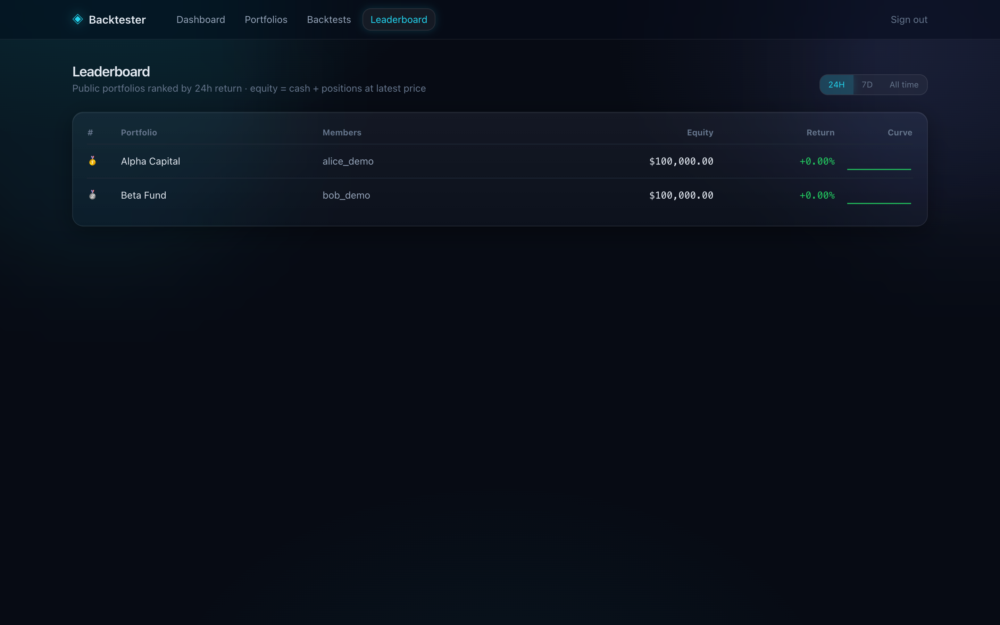

# Backtester — multi-asset backtesting & multiplayer paper trading

[](https://github.com/Manav0559/backtester/actions/workflows/ci.yml)


[](LICENSE)


Write strategies (or bring your own Python), backtest them on real historical
prices with honest statistics, paper-trade live prices inside **shared**
portfolios, and compete on time-windowed leaderboards — with production-grade
observability bolted on, not bolted after.

The design goal is **honesty about performance**: every backtest reports a
Deflated Sharpe next to the raw Sharpe, ML strategies are walk-forward and
out-of-sample only (embargoed CV), and the engine enforces no-lookahead
(`position = signal.shift(1)`) so a strategy can never trade on information it
wouldn't have had.

| | |
| --- | --- |
|  |  |
|  |  |



> Screenshots are generated, not hand-taken: `./scripts/demo.sh` then
> `cd frontend && node scripts/capture-screenshots.mjs` re-captures all five
> against the seeded stack (headless system Chrome via Playwright).

---

## One-command demo

```bash
./scripts/demo.sh
```

Builds and starts the full stack, backfills **real** AAPL + MSFT (5y,
yfinance) and BTC (Binance) daily history, creates two demo users with public
portfolios and real trades, and runs one backtest of every kind — classic,
long/short portfolio, XGBoost ML, and user-submitted Python — through the
actual Celery worker. When it prints `✔ demo ready`:

| What | Where | Login |
| --- | --- | --- |
| App | http://localhost:3000 | `alice@demo.backtester.dev` / `demo-pass-123` |
| Grafana | http://localhost:3001/d/backtester-main | `admin` / `admin` |
| Prometheus | http://localhost:9090/alerts | — |

(Ports overridable: `FRONTEND_PORT=3005 ./scripts/demo.sh`.)

---

## Feature tour

**1 · TradingView-grade indicator engine.** One `IndicatorService`
(pandas-ta, **151 indicators**) serves the charting API, the built-in
strategies, and the user sandbox — so a chart overlay and a backtest of the
same indicator can never disagree. Params are validated against real
signatures; ichimoku's forward span is dropped because it is future-dated
output (lookahead).

**2 · Strategy registry on one contract.** Every algorithm — legacy
factories, class-based classics (Donchian breakout, Bollinger reversion, MACD
trend, z-score **pairs trading**), ML, user code — implements the same
`BaseStrategy` target-weight contract: weights per asset per bar, `>0` long,
`<0` short, `sum(|w|)` = gross leverage. `GET /strategies/registry` drives the
frontend, which hardcodes nothing.

**3 · Bring-your-own-code sandbox.** Users submit a Python class
(`setup()` / `next(i, bar)` / vectorized `generate()`, plus
`self.indicator("rsi", length=14)`); an AST allowlist rejects imports, dunder
access, and exec/eval **with line numbers, at submission time**; execution runs
under curated builtins in the memory-capped worker container, and output is
clipped to the weight contract. The engine's `shift(1)` applies to user code
too — lookahead is structurally impossible.

**4 · Interactive charting.** TradingView's `lightweight-charts` v5 with
candles/line/bars modes and server-computed indicator overlays picked from the
full catalog; price-scale indicators overlay the candles, oscillators
auto-split into their own pane (decided data-driven, no hand-kept list).

**5 · Liquid-glass UI.** Frosted translucent panels (backdrop-blur +
layered gradients), framer-motion route transitions and a gliding nav pill,
staggered section entrances, glass toasts, shimmer skeletons — with
`prefers-reduced-motion` respected throughout.

**Plus the platform underneath:** multiplayer portfolios sharing ONE cash
balance (row-locked, WebSocket-synced), time-windowed leaderboards (24h / 7d /
all) computed from periodic equity snapshots in a single SQL statement, and a
provisioned Prometheus + Grafana observability stack with alerting.

---

## Architecture

```
                       Next.js 14 (App Router, TS, lightweight-charts, framer-motion)
                            │  /api rewrite            │ WebSocket /ws
                            ▼                          ▼
                       FastAPI  ──────────────►  streaming hub (Redis pub/sub fan-out)
                        │  │ │
        ┌───────────────┘  │ └─────────────┐
        ▼                  ▼               ▼
  PostgreSQL +        Redis (broker)   /metrics ◄──────────┐
  TimescaleDB              │                               │ scrape
  (OHLCV hypertable,       ▼                               │
   ledger, snapshots)  Celery worker + beat ──► :9200 ◄────┤
        ▲              (backtests, equity snapshots)       │
        └── alembic    │                              Prometheus ──► Grafana
            migrate    └── IndicatorService ─ StrategyRegistry ─ BYOC sandbox
            (one-shot)         (pandas-ta)      (BaseStrategy)    (AST-gated exec)
```

- **Backend** — Python 3.13, FastAPI, SQLAlchemy 2.0, Alembic, Celery (worker
  + embedded beat).
- **Data** — TimescaleDB hypertable for OHLCV; Redis for the tick bus, WS
  fan-out, Celery broker/results.
- **Quant/ML** — pandas, numpy, scipy, pandas-ta, scikit-learn, xgboost.
- **Observability** — prometheus-client (multiprocess-aware), Prometheus with
  alert rules, provisioned Grafana dashboard.

---

## Quick start (dev loop)

```bash
docker compose up -d                        # infra only: db :5433 + redis :6380

cd backend
python -m venv .venv && . .venv/bin/activate
pip install -r requirements-dev.txt
alembic upgrade head
uvicorn app.main:app --port 8000
# second shell — worker + beat (equity snapshots):
celery -A app.backtest.tasks:celery_app worker -B --loglevel=info

cd ../frontend && npm install && npm run dev    # http://localhost:3000
```

Full stack instead: `docker compose --profile app up -d --build` (a one-shot
`migrate` service must exit 0 before backend/worker start, so nothing races an
unmigrated DB).

Tests: `cd backend && python -m pytest tests/ -q` (needs db + redis up).
CI runs the suite against ephemeral Timescale/Redis containers and builds +
lints the frontend on every push.

---

## Observability & alerting

- Every request gets an `X-Request-ID` + structured access log; Prometheus
  metrics at `GET /metrics` labeled by **route template** (bounded
  cardinality). The worker exposes `backtest_duration_seconds{strategy,status}`
  and a snapshot-freshness gauge on `:9200` — prefork children write to
  `PROMETHEUS_MULTIPROC_DIR` mmap files merged by a `MultiProcessCollector`.
- **Alert rules** (`observability/alerts.yml`): API 5xx ratio > 5%, p99 > 1s,
  backtest failure ratio > 20%, and equity-snapshot staleness (beat silent
  15+ min). They surface on the Grafana dashboard's alert row via the `ALERTS`
  metric.
- **Grafana is fully provisioned from the repo** — datasource + dashboard JSON
  under `observability/grafana/`; nothing is clicked together by hand.
- Redis-backed fixed-window rate limiter (120 req/min, **fails open**).

---

## Design decisions & tradeoffs (the honest section)

- **`Decimal` end-to-end for money.** Slower than float, but a paper-trading
  ledger that drifts by binary-float cents is worse than slow. The backtest
  engine, by contrast, is float/NumPy — there the quantity of interest is a
  return series, not an account balance.
- **Vectorized engine, close-to-close fills.** No intrabar simulation, no
  bid/ask spread model — costs are commission bps on turnover plus optional
  borrow. That's the right fidelity for daily-bar strategy research; it is not
  an execution simulator.
- **Deflated Sharpe by default** because `n_trials` honesty is cheap and
  overfitting is the default failure mode of backtesting platforms.
- **Equity history replays the ledger, marking positions at the last fill
  price between trades** (latest close only for the terminal point). That's an
  approximation — a position's value between trades doesn't tick with the
  market — chosen so the curve is O(ledger entries) with ONE batched query,
  which lets the leaderboard sparkline N portfolios without N+1 price scans.
- **Windowed leaderboards read periodic snapshots, not full replays.** A
  5-minute beat writes `portfolio_equity_snapshots` in one atomic
  `INSERT … FROM SELECT` (the read-then-insert version raced portfolio
  deletion — found live, fixed by construction). Window baselines are then a
  single correlated subquery riding the PK index.
- **The BYOC sandbox is defense-in-depth, not a hostile-multitenant jail.**
  AST allowlist + curated builtins stop accidents and casual abuse; the real
  fence is the worker container (non-root, memory rlimit, no secrets beyond
  its own DB creds). Running truly untrusted code would need gVisor/Firecracker
  — out of scope for this deployment shape, and documented as such.
- **Compose, not Kubernetes.** The whole platform is a single-box deployment
  with healthchecked dependency ordering. K8s manifests would demo YAML, not
  engineering; the compose file already encodes the real operational lessons
  (build-time env baking, IPv6 healthcheck pitfalls, multiprocess metrics).
- **Rate limiter fails open.** If Redis is down, requests pass unmetered —
  availability over strictness for a trading *simulator*. The CHECK constraint
  on cash is the invariant that must never fail open, and it's in Postgres.
- **`is_public` is opt-in at creation** — competing on the leaderboard is a
  choice, not a default.

---

## Key endpoints

| Method | Path | Purpose |
| --- | --- | --- |
| `POST` | `/auth/register` `/auth/login` `/auth/refresh` | JWT auth (access + refresh) |
| `GET` | `/assets` · `/assets/{id}/bars` | instruments + OHLCV |
| `GET` | `/indicators` · `/assets/{id}/indicators?spec=rsi:length=14;macd` | indicator catalog + overlay series |
| `GET` | `/strategies/registry` | every runnable strategy + defaults + BYOC template |
| `POST` | `/strategies/validate` | static-check user code (line-numbered errors) |
| `POST` | `/backtests` | submit (built-in or `custom_code` + `code`) → Celery |
| `GET` | `/backtests/{id}` · `/backtests/{id}/yearly` | results, diagnostics, yearly slices |
| `POST` | `/portfolios` · `/portfolios/{id}/orders` | shared portfolios, locked-ledger fills |
| `GET` | `/leaderboard?window=24h\|7d\|all` | windowed public rankings |
| `GET` | `/portfolios/{id}/equity-history` | ledger-replayed equity curve |
| `WS` | `/ws` | live price + portfolio event fan-out |
| `GET` | `/metrics` | Prometheus exposition |

## Configuration

Everything loads from env / `backend/.env` (`backend/.env.example`). Notable:
`DATABASE_URL`, `REDIS_URL`, `JWT_SECRET`, `CORS_ORIGINS`,
`RATE_LIMIT_PER_MINUTE`, `COMMISSION_BPS`, `EQUITY_SNAPSHOT_INTERVAL_MINUTES`,
`BACKTEST_MEMORY_CAP_MB`.
